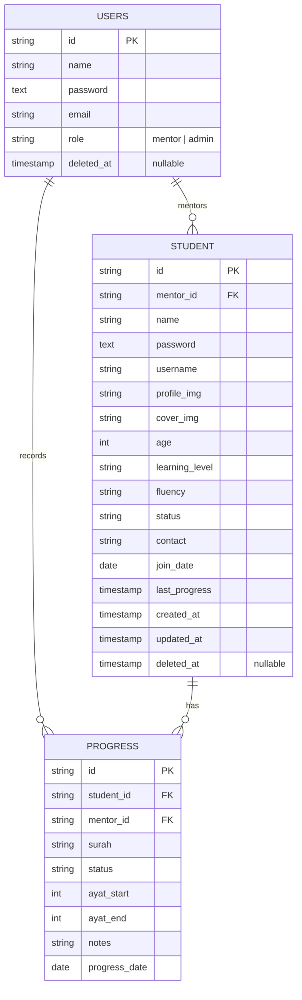

# 🕌 Backend — Mosque Tahfidz Management

RESTful API backend for the **Mosque Tahfidz Management System** — a platform to manage Quran memorization (tahfidz) programs at mosques. Built with Go, Fiber, and PostgreSQL.

You can find the frontend in this [repository](https://github.com/AbiPasundan/mosque-tahfidz-management)

---

## Table of Contents

- [Features](#features)
- [Tech Stack](#tech-stack)
- [Architecture](#architecture)
- [Project Structure](#project-structure)
- [Getting Started](#getting-started)
  - [Prerequisites](#prerequisites)
  - [Installation](#installation)
  - [Environment Variables](#environment-variables)
  - [Database Setup](#database-setup)
  - [Running the Server](#running-the-server)
- [API Reference](#api-reference)
- [Database Schema](#database-schema)
- [Deployment](#deployment)
  - [Docker](#docker)
  - [CI/CD — Google Cloud Run](#cicd--google-cloud-run)
- [Makefile Commands](#makefile-commands)
- [License](#license)

---

## Features

- **Authentication & Authorization** — JWT-based auth with role-based access control (`admin`, `mentor`)
- **User Management** — Full CRUD for admin/mentor accounts (admin-only)
- **Student Management** — Register, update, and track students with profile/cover images
- **Progress Tracking** — Record daily Quran memorization progress (surah, ayat range, status)
- **Bulk Progress Entry** — Create multiple progress records in a single request
- **Dashboard Summary** — Aggregated statistics for the tahfidz program overview
- **Surah Reference** — Built-in list of all 114 surahs of the Quran
- **Image Upload** — Cloudinary integration with server-side image compression
- **Activity Logs** — Audit trail for system actions (admin-only)
- **Database Seeding** — Pre-built seeders for users, students, progress, and admin accounts
- **Rate Limiting** — Request throttling on auth endpoints
- **Structured Logging** — Request-scoped logging with zerolog

---

## Tech Stack

| Category             | Technology                                                                |
| -----------------    | -----------------------------------------------------------------------   |
| **Language**         | Go 1.25                                                                   |
| **Framework**        | [Fiber v2](https://gofiber.io/)                                           |
| **Database**         | PostgreSQL (NeonDB compatible)                                            |
| **ORM / SQL**        | [sqlx](https://github.com/jmoiron/sqlx)                                   |
| **Auth**             | [golang-jwt/jwt v5](https://github.com/golang-jwt/jwt)                    |
| **Validation**       | [go-playground/validator v10](https://github.com/go-playground/validator) |
| **Logging**          | [zerolog](https://github.com/rs/zerolog)                                  |
| **Image Upload**     | Cloudinary (via REST API)                                                 |
| **Migrations**       | [golang-migrate](https://github.com/golang-migrate/migrate)               |
| **Containerization** | Docker (multi-stage build)                                                |
| **CI/CD**            | GitHub Actions → Google Cloud Run                                         |

---

## Architecture

The project follows a **clean, domain-driven layered architecture** with dependency injection via a central container.

```text
Request → Middleware → Handler → Service → Repository → Database
```

Each domain module (`auth`, `student`, `progress`, etc.) is self-contained with its own:

| Layer          | Responsibility                            |
| -------------- | ----------------------------------------- |
| `model.go`     | Database entity / struct definitions      |
| `dto.go`       | Request/response Data Transfer Objects    |
| `repository.go`| Database queries (sqlx)                   |
| `service.go`   | Business logic                            |
| `handler.go`   | HTTP handler (Fiber context)              |

**Middleware stack** (applied in order):

1. `RequestID` — Unique request identifier
2. `Logger` — Structured request logging (zerolog)
3. `Recover` — Panic recovery
4. `CORS` — Configurable cross-origin policy
5. `JWT` — Token authentication (per-route)
6. `RBAC` — Role-based authorization (per-route)

---

## Project Structure

```markdown
backend-mosque-tahfidz-management/
├── cmd/
│   ├── api/main.go              # API server entrypoint
│   └── seed/main.go             # Database seeder entrypoint
├── container/
│   └── container.go             # Dependency injection container
├── internal/
│   ├── config/                  # Environment & database config
│   ├── constants/               # Application constants
│   ├── database/
│   │   ├── migrations/          # SQL migration files (up/down)
│   │   └── seeds/               # Database seeders
│   ├── domain/
│   │   ├── auth/                # Authentication & user management
│   │   ├── student/             # Student CRUD & queries
│   │   ├── progress/            # Memorization progress tracking
│   │   ├── activity_log/        # Audit logging
│   │   ├── surah/               # Quran surah reference data
│   │   └── upload/              # Cloudinary image upload & compression
│   ├── middleware/               # HTTP middleware (JWT, RBAC, CORS, etc.)
│   └── routes/                  # Route definitions
├── pkg/
│   ├── token/                   # JWT token maker interface & implementation
│   └── utils/                   # Shared utilities (pagination, response, validation, password)
├── .github/workflows/deploy.yml # CI/CD pipeline
├── Dockerfile                   # Multi-stage production build
├── Makefile                     # Development commands
├── ERD.mermaid                  # Entity-Relationship Diagram
├── go.mod / go.sum              # Go module dependencies
└── .env.example                 # Environment variable template
```

---

## Getting Started

### Prerequisites

- **Go** ≥ 1.25
- **PostgreSQL** (local or hosted, e.g., NeonDB)
- **golang-migrate** CLI — [install guide](https://github.com/golang-migrate/migrate/tree/master/cmd/migrate)
- **Cloudinary** account (for image uploads)

### Installation

```bash
# Clone the repository
git clone https://github.com/your-org/backend-mosque-tahfidz-management.git
cd backend-mosque-tahfidz-management

# Install Go dependencies
go mod download
```

### Environment Variables

Copy the example file and fill in your values:

```bash
cp .env.example .env
```

| Variable                 | Description                           | Example                        |
| ------------------------ | ------------------------------------- | ------------------------------ |
| `PORT`                   | Server port                           | `3010`                         |
| `DB_HOST`                | PostgreSQL host                       | `your-neondb-host`             |
| `DB_PORT`                | PostgreSQL port                       | `5432`                         |
| `DB_USER`                | Database user                         | `your-db-user`                 |
| `DB_PASSWORD`            | Database password                     | `your-db-password`             |
| `DB_NAME`                | Database name                         | `management_siswa`             |
| `DB_SSL_MODE`            | SSL mode                              | `require`                      |
| `JWT_SECRET`             | JWT signing secret (min 32 chars)     | `your-32-char-secret-key-...`  |
| `ALLOW_ORIGINS`          | Comma-separated CORS origins          | `http://localhost:5173`        |
| `CLOUDINARY_CLOUD_NAME`  | Cloudinary cloud name                 | `your-cloud-name`              |
| `CLOUDINARY_API_KEY`     | Cloudinary API key                    | `your-api-key`                 |
| `CLOUDINARY_API_SECRET`  | Cloudinary API secret                 | `your-api-secret`              |

### Database Setup

```bash
# Run all migrations
make migrate-up

# Seed the database with sample data
make seed

# Or seed only the admin account
make seed-admin
```

### Running the Server

```bash
# Start the development server
make dev
```

The API will be available at `http://localhost:3010`.

---

## API Reference

All endpoints are prefixed with `/api/v1`.

### Authentication

| Method  | Endpoint             | Auth | Role  | Description            |
| ------- | -------------------- | ---- | ----- | ---------------------- |
| `POST`  | `/auth/login`        | ❌   | —     | Login with credentials |
| `POST`  | `/auth/logout`       | ❌   | —     | Logout                 |
| `GET`   | `/auth/me`           | ✅   | Any   | Get current user       |
| `PATCH` | `/auth/profile`      | ✅   | Any   | Update own profile     |
| `PATCH` | `/auth/password`     | ✅   | Any   | Change own password    |

### Users (Admin Only)

| Method   | Endpoint       | Auth | Role    | Description         |
| -------- | -------------- | ---- | ------- | ------------------- |
| `GET`    | `/users`       | ✅   | Admin   | List all users      |
| `POST`   | `/users`       | ✅   | Admin   | Create a new user   |
| `GET`    | `/users/:id`   | ✅   | Admin   | Get user by ID      |
| `PUT`    | `/users/:id`   | ✅   | Admin   | Update user         |
| `DELETE` | `/users/:id`   | ✅   | Admin   | Delete user         |

### Mentors

| Method | Endpoint          | Auth | Role | Description        |
| ------ | ----------------- | ---- | ---- | ------------------ |
| `GET`  | `/mentors/:id`    | ✅   | Any  | Get mentor detail  |

### Students

| Method   | Endpoint         | Auth | Role           | Description         |
| -------- | ---------------- | ---- | -------------- | ------------------- |
| `GET`    | `/students`      | ❌   | —              | List all students   |
| `POST`   | `/students`      | ✅   | Mentor, Admin  | Create student      |
| `GET`    | `/students/:id`  | ❌   | —              | Get student by ID   |
| `PUT`    | `/students/:id`  | ✅   | Mentor, Admin  | Update student      |
| `DELETE` | `/students/:id`  | ✅   | Admin          | Delete student      |

### Progress

| Method | Endpoint          | Auth | Role           | Description               |
| ------ | ----------------- | ---- | -------------- | ------------------------- |
| `GET`  | `/progress`       | ✅   | Mentor, Admin  | List progress records     |
| `POST` | `/progress`       | ✅   | Mentor, Admin  | Create progress record    |
| `POST` | `/progress/bulk`  | ✅   | Mentor, Admin  | Bulk create progress      |
| `PUT`  | `/progress/:id`   | ✅   | Mentor, Admin  | Update progress record    |

### Dashboard

| Method | Endpoint              | Auth | Role | Description            |
| ------ | --------------------- | ---- | ---- | ---------------------- |
| `GET`  | `/dashboard/summary`  | ❌   | —    | Get dashboard stats    |

### Surahs

| Method | Endpoint    | Auth | Role | Description             |
| ------ | ----------- | ---- | ---- | ----------------------- |
| `GET`  | `/surahs`   | ❌   | —    | List all 114 surahs     |

### Activity Logs

| Method | Endpoint          | Auth | Role  | Description          |
| ------ | ----------------- | ---- | ----- | -------------------- |
| `GET`  | `/activity-logs`  | ✅   | Admin | List activity logs   |

### File Upload

| Method | Endpoint   | Auth | Role           | Description                   |
| ------ | ---------- | ---- | -------------- | ----------------------------- |
| `POST` | `/upload`  | ✅   | Mentor, Admin  | Upload image (Cloudinary)     |

---

## Database Schema



---

## Deployment

### Docker

Build and run the production image locally:

```bash
# Build the image
docker build -t mosque-tahfidz-api .

# Run the container
docker run -p 3010:3010 --env-file .env mosque-tahfidz-api
```

The Dockerfile uses a **multi-stage build**:

1. **Builder stage** — Compiles a static Go binary with stripped debug symbols
2. **Runtime stage** — Minimal Alpine image running as a non-root user

### CI/CD — Google Cloud Run

Automated deployment is configured via GitHub Actions (`.github/workflows/deploy.yml`):

1. **Trigger** — Push to `main` branch
2. **Authenticate** — Google Cloud via Workload Identity Federation
3. **Build & Push** — Docker image to Google Artifact Registry (`asia-southeast1`)
4. **Deploy** — Google Cloud Run with auto-scaling (0–5 instances)

**Required GitHub Secrets:**

| Secret                     | Description                              |
| -------------------------- | ---------------------------------------- |
| `GCP_PROJECT_ID`           | Google Cloud project ID                  |
| `GCP_WIF_PROVIDER`         | Workload Identity Federation provider    |
| `GCP_WIF_SERVICE_ACCOUNT`  | Service account for WIF                  |

---

## Makefile Commands

| Command            | Description                                      |
| ------------------ | ------------------------------------------------ |
| `make dev`         | Start the development server                     |
| `make migrate-up`  | Run all database migrations                      |
| `make migrate-down`| Rollback all database migrations                 |
| `make seed`        | Seed database with sample data                   |
| `make seed-fresh`  | Clean and re-seed all data                       |
| `make seed-clean`  | Remove all seeded data                           |
| `make seed-admin`  | Seed only the admin account                      |

---

## License

This project is proprietary. All rights reserved.
